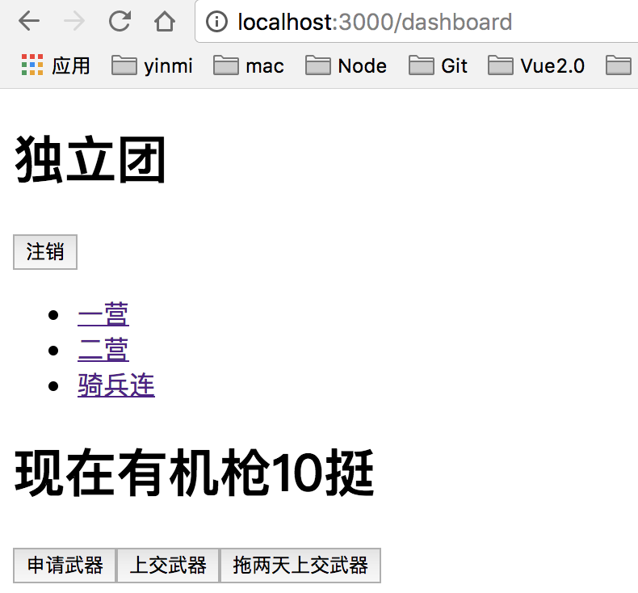

## react-router4基础知识
    
[官网](https://reacttraining.com/react-router/web/example/basic)

### react-router4是什么
    
* react-router4是全新的版本，和之前版本不兼容，特点：浏览器和RN均兼容
    
* react开发单页应用必备，践行路由即组件的概念
    
* 核心概念：动态路由、Route、Link、Switch
  
   
#### 一个简单的例子 
       
* 安装：npm install react-router-dom --save  
    
* router4使用react-router-dom作为浏览器的路由
    
* 忘记router2的内容，拥抱最新的router4 
   
#### 入门组件

* BrowserRouter，HashRouter包裹整个应用，只使用一次
   
* Router路由对应渲染的组件，可嵌套
   
* Link跳转专用
   
   
   多页应用案例：一个导航下面多个页面(最简单的应用)
   
        import React from 'react'
        import ReactDOM from 'react-dom'
        import {createStore,applyMiddleware,compose} from 'redux'
        import thunk from 'redux-thunk'
        import {Provider} from 'react-redux'
        import {BrowserRouter,Route,Link} from 'react-router-dom'
        
        import App from './App'
        import {counter,addGun,removeGun,addGunAsync} from './index.redux'
        
        const reduxDevTools = window.devToolsExtension?window.devToolsExtension():()=>{};
        // 创建store
        const store = createStore(counter,compose(
            applyMiddleware(thunk),
            reduxDevTools
        ));
        function Erying() {
            return <h1>二营</h1>
        }
        function Qibinglian() {
            return <h1>骑兵连</h1>
        }
        ReactDOM.render(
            <Provider store={store}>
                <BrowserRouter>
                    

                        <ul>
                            <li>
                                <Link to='/'>一营</Link>
                            </li>
                            <li>
                                <Link to='/erying'>二营</Link>
                            </li>
                            <li>
                                <Link to='/qibinglian'>骑兵连</Link>
                            </li>
                        </ul>
                        <Route path='/' exact component={App}></Route>
                        <Route path='/erying' component={Erying}></Route>
                        <Route path='/qibinglian' component={Qibinglian}></Route>
                    

                </BrowserRouter>
            </Provider>
            , document.getElementById('root')
        )
    
> 结果如下图所示：
 
 默认路由：       

点击二营：

点击骑兵连：

#### 其他组件

* url参数，Route组件参数可用冒号标识参数，在子组件内部通过 this.props.match.params.自定义参数 获取url的参数

src/index.js

        import React from 'react'
        import ReactDOM from 'react-dom'
        import {createStore,applyMiddleware,compose} from 'redux'
        import thunk from 'redux-thunk'
        import {Provider} from 'react-redux'
        import {BrowserRouter,Route,Link} from 'react-router-dom'
        
        import App from './App'
        import {counter,addGun,removeGun,addGunAsync} from './index.redux'
        
        const reduxDevTools = window.devToolsExtension?window.devToolsExtension():()=>{};
        // 创建store
        const store = createStore(counter,compose(
            applyMiddleware(thunk),
            reduxDevTools
        ));
        function Erying() {
            return <h1>二营</h1>
        }
        function Qibinglian() {
            return <h1>骑兵连</h1>
        }
        class Test extends React.Component{
            // componentWillMount(){
            //     this.props.history.push('/erying');
            // }
            render(){
                console.log(this.props)
                return (
                    

                        <h1>测试组件:{this.props.match.params.myParam}</h1>
                    

                )
            }
        }
        ReactDOM.render(
            <Provider store={store}>
                <BrowserRouter>
                    

                        <ul>
                            <li>
                                <Link to='/'>一营</Link>
                            </li>
                            <li>
                                <Link to='/erying'>二营</Link>
                            </li>
                            <li>
                                <Link to='/qibinglian'>骑兵连</Link>
                            </li>
                        </ul>
                        <Route path='/' exact component={App}></Route>
                        <Route path='/:myParam' component={Test}></Route>
                    

                </BrowserRouter>
            </Provider>
            , document.getElementById('root')
        )
        
测试组件Test中打印props，结果如下：
    

* Redirect组件跳转，两个方式，一个使用Redirect，另一个是使用history的push()方法

* Switch只渲染一个子Route组件,多个组件值渲染第一个，动画，多个页面，404NotFound页面

    只渲染匹配中的第一个Route

    
        import React from 'react'
        import ReactDOM from 'react-dom'
        import {createStore,applyMiddleware,compose} from 'redux'
        import thunk from 'redux-thunk'
        import {Provider} from 'react-redux'
        import {
            BrowserRouter,
            Route,
            Link,
            Redirect,
            Switch
        } from 'react-router-dom'
        
        import App from './App'
        import {counter,addGun,removeGun,addGunAsync} from './index.redux'
        
        const reduxDevTools = window.devToolsExtension?window.devToolsExtension():()=>{};
        // 创建store
        const store = createStore(counter,compose(
            applyMiddleware(thunk),
            reduxDevTools
        ));
        function Erying() {
            return <h1>二营</h1>
        }
        function Qibinglian() {
            return <h1>骑兵连</h1>
        }
        class Test extends React.Component{
            // componentWillMount(){
            //     this.props.history.push('/erying');
            // }
            render(){
                console.log(this.props)
                return (
                    

                        <h1>测试组件:{this.props.match.params.myParam}</h1>
                    

                )
            }
        }
        ReactDOM.render(
            <Provider store={store}>
                <BrowserRouter>
                    

                        <ul>
                            <li>
                                <Link to='/'>一营</Link>
                            </li>
                            <li>
                                <Link to='/erying'>二营</Link>
                            </li>
                            <li>
                                <Link to='/qibinglian'>骑兵连</Link>
                            </li>
                        </ul>
                        <Switch>
                            <Route path='/' exact component={App}></Route>
                            <Route path='/erying' component={Erying}></Route>
                            <Route path='/qibinglian' component={Qibinglian}></Route>
                            <Route path='/:myParam' component={Test}></Route>
                            {/*<Redirect to='/qibinglian'></Redirect>*/}
                        </Switch>
                    

                </BrowserRouter>
            </Provider>
            , document.getElementById('root')
        )
    
    
* 和redux配合

复杂redux应用，多个reducer，用combineReducers合并

src/index.js

    import React from 'react'
    import ReactDOM from 'react-dom'
    import {createStore,applyMiddleware,compose} from 'redux'
    import thunk from 'redux-thunk'
    import {Provider} from 'react-redux'
    import {
        BrowserRouter,
        Route,
        Link,
        Redirect,
        Switch
    } from 'react-router-dom'
    
    // import {counter} from './index.redux'
    import reducers from './reducer'
    import Auth from './Auth'
    import Dashboard from './Dashboard'
    
    const reduxDevTools = window.devToolsExtension?window.devToolsExtension():()=>{};
    // 创建store
    const store = createStore(reducers,compose(
        applyMiddleware(thunk),
        reduxDevTools
    ));
    
    console.log(store.getState())
    
    class Test extends React.Component{
        render(){
            console.log(this.props)
            return (
                

                    <h1>测试组件:{this.props.match.params.myParam}</h1>
                

            )
        }
    }
    
    /**
     * 登录
     * 没有登录信息，同意跳转到login
     * 
     * 页面 导航+显示+注销
     * yiying
     * erying
     * qibinglian
     */
    
    ReactDOM.render(
        <Provider store={store}>
            <BrowserRouter>
                <Switch>
                    <Route path='/login' component={Auth}></Route>
                    <Route path='/dashboard' component={Dashboard}></Route>
                    <Redirect to='/dashboard'></Redirect>
                </Switch>
            </BrowserRouter>
        </Provider>
        , document.getElementById('root')
    )
    
    
src/App.js

    import React from 'react'
    import {connect} from 'react-redux'
    import {addGun, removeGun, addGunAsync} from './index.redux'
    
    @connect(
        state=>({num:state.counter}),
        {addGun, removeGun, addGunAsync}
    )
    
    class App extends React.Component {
        render() {
            return (
                

                    <h1>现在有机枪{this.props.num}挺</h1>
                    <button onClick={this.props.addGun}>申请武器</button>
                    <button onClick={this.props.removeGun}>上交武器</button>
                    <button onClick={this.props.addGunAsync}>拖两天上交武器</button>
                

            )
        }
    }
    
    export default App;
    
src/Dashboard.js
    
    // 路由
    /**
     * 导航，子路由
     */
    import React from 'react'
    import { Link,Route,Redirect } from 'react-router-dom'
    import { connect } from 'react-redux'
    
    import App from './App'
    import {login, logout} from "./Auth.redux";
    
    function Erying() {
        return <h1>二营</h1>
    }
    function Qibinglian() {
        return <h1>骑兵连</h1>
    }
    @connect(
       state=>state.auth,
        { logout }
    )
    class Dashboard extends React.Component{
        constructor(props){
            super(props);
        }
        render(){
            console.log(this.props)
            const redirectToLogin = <Redirect to='/login'></Redirect>
            const app = (
                

                    <h1>独立团</h1>
                    {this.props.isAuth ? <button onClick={this.props.logout}>注销</button> : null}
                    <ul>
                        <li>
                            <Link to='/dashboard/'>一营</Link>
                        </li>
                        <li>
                            <Link to='/dashboard/erying'>二营</Link>
                        </li>
                        <li>
                            <Link to='/dashboard/qibinglian'>骑兵连</Link>
                        </li>
                    </ul>
                    <Route path='/dashboard/' exact component={App}></Route>
                    <Route path='/dashboard/erying' component={Erying}></Route>
                    <Route path='/dashboard/qibinglian' component={Qibinglian}></Route>
                

            )
            // 判断用户是否登录，如果登录的话显示dashboard组件
            return this.props.isAuth ? app : redirectToLogin;
        }
    }
    export default Dashboard
    
src/Auth.js

    // 认证的页面
    import React from 'react'
    import {connect} from 'react-redux'
    import {Redirect} from 'react-router-dom'
    
    import {login} from "./Auth.redux";
    
    // 两个reducers，每个reducers都有一个state，所以需要合并reducers
    
    @connect(
        state=>state.auth,
        {login}
    )
    
    class Auth extends React.Component{
        constructor(props){
            super(props);
        }
        render(){
          return(
              

                  {this.props.isAuth ? <Redirect to='/dashboard'></Redirect> : null}
                  <h2>你没有权限，需要登录才能看</h2>
                  <button onClick={this.props.login}>登录</button>
              

          )
        }
    }
    export default Auth
    
src/index.redux.js

    const ADD_GUN = '加机关枪'
    const REMOVE_GUN = '减机关枪'
    
    // reducer
    export function counter(state = 0, action) {
        switch (action.type) {
            case ADD_GUN:
                return state + 1
            case REMOVE_GUN:
                return state - 1
            default:
                return 10
        }
    }
    
    // action creator
    export function addGun() {
        return {type: ADD_GUN}
    }
    
    export function removeGun() {
        return {type: REMOVE_GUN}
    }
    
    // 异步，延迟2s
    export function addGunAsync() {
        return dispatch=>{
            setTimeout(()=>{
                dispatch(removeGun())
            },2000)
        }
    }
    
src/Auth.redux.js

    // 登录相关的redux页面
    
    const LOGIN = 'LOGIN'
    const LOGOUT = 'LOGOUT'
    
    export function auth(state={isAuth:false,user:'李云龙'},action) {
        switch (action.type){
            case LOGIN:
                return {...state,isAuth:true}
            case LOGOUT:
                return {...state,isAuth:false}
            default:
                return state;
        }
    }
    
    // action
    export function login() {
        return {type:LOGIN}
    }
    export function logout() {
        return {type:LOGOUT}
    }
    
src/reducer.js

    // 合并所有的reducer，并且返回
    
    import {combineReducers} from 'redux'
    
    import {counter} from "./index.redux"
    import {auth} from "./Auth.redux"
    
    export default combineReducers({counter,auth})
                        

效果图如下：

   
   
   
    
### react-router4核心概念
### react-router4实战