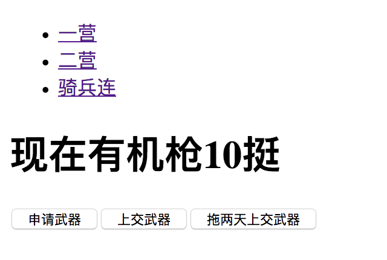
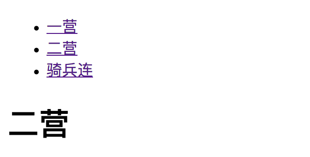
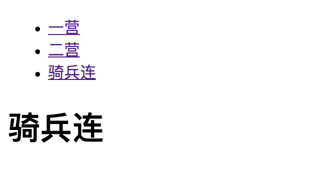

# redux and react-router

##  redux

### redux如何和react一起使用

把store.dispatch()方法传递给子组件，内部可以调用修改状态

subscribe订阅render函数，每次修改都要重新渲染

redux的reducer和action相关内容，移到单独的文件index.redux.js单独管理

### 手动连接使用redux

#### 定义redux,包括reducer，actions

src/index.redux.js

    const ADD_GUN = '加机关枪'
    const REMOVE_GUN = '减机关枪'
    
    // reducer
    export function counter(state = 0, action) {
        switch (action.type) {
            case ADD_GUN:
                return state + 1
            case REMOVE_GUN:
                return state - 1
            default:
                return 10
        }
    }
    
    // action creator
    export function addGun() {
        return {type: ADD_GUN}
    }
    
    export function removeGun() {
        return {type: REMOVE_GUN}
    }
    
#### 引用redux

src/index.js

    import React from 'react'
    import ReactDOM from 'react-dom'
    import {createStore} from 'redux'
    
    import App from './App'
    import {counter,addGun,removeGun} from './index.redux'
    
    // 创建store
    const store = createStore(counter);
    
    function render() {
        ReactDOM.render(<App store={store} addGun={addGun} removeGun={removeGun}/>, document.getElementById('root'))
    }
    
    render();
    
    // 订阅render函数，如果组件的状态有变化，组件会重新执行
    store.subscribe(render);
    
src/App.js

    import React from 'react'
    
    // import {addGun} from "./index.redux";
    
    class App extends React.Component{
        constructor(props){
            super(props)
        }
        render(){
            const store = this.props.store;
            const num = store.getState();
            const addGun = this.props.addGun;
            const removeGun = this.props.removeGun;
            return(
                

                    <h1>现在有机枪{num}挺</h1>
                    <button onClick={()=>{store.dispatch(addGun())}}>申请武器</button>
                    <button onClick={()=>{store.dispatch(removeGun())}}>上交武器</button>
                

            )
        }
    }
    
    export default App;
    

### 处理异步，调试工具，更优雅的和react结合

* redux处理异步，需要redux-thunk插件

    redux-thunk中间件可以让action创建函数先不返回一个action对象，而是返回一个函数，函数传递两个参数(dispatch,getState),在函数体内进行业务逻辑的封装

    安装： npm install redux-thunk --save

    使用：使用applyMiddleware开启thunk中间件，action返回函数，使用dispatch提交action
    
    src/index.js
    
        import React from 'react'
        import ReactDOM from 'react-dom'
        import {createStore,applyMiddleware} from 'redux'
        import thunk from 'redux-thunk'
        
        import App from './App'
        import {counter,addGun,removeGun,addGunAsync} from './index.redux'
        
        // 创建store
        const store = createStore(counter,applyMiddleware(thunk));
        
        function render() {
            ReactDOM.render(<App store={store} addGun={addGun} removeGun={removeGun} addGunAsync={addGunAsync}/>, document.getElementById('root'))
        }
        
        render();
        
        // 订阅render函数，如果组件的状态有变化，组件会重新执行
        store.subscribe(render);
        
    scr/index.redux.js
        
        const ADD_GUN = '加机关枪'
        const REMOVE_GUN = '减机关枪'
        
        // reducer
        export function counter(state = 0, action) {
            switch (action.type) {
                case ADD_GUN:
                    return state + 1
                case REMOVE_GUN:
                    return state - 1
                default:
                    return 10
            }
        }
        
        // action creator
        export function addGun() {
            return {type: ADD_GUN}
        }
        
        export function removeGun() {
            return {type: REMOVE_GUN}
        }
        
        // 异步，延迟2s
        export function addGunAsync() {
            return dispatch=>{
                setTimeout(()=>{
                    dispatch(addGun())
                },2000)
            }
        }
    

    
* 使用redux的compose，结合react-thunk和devToolsExtension，以方便调试和观察state

    安装redux-devtools-extension插件：npm install redux-devtools-extension --save并开启

    新建store的时候判断window.devToolsExtension
    
    使用compose结合thunk和window.devToolsExtension
    
    调试窗的redux选项卡实时看到state
    
    src/index.js
        
        import React from 'react'
        import ReactDOM from 'react-dom'
        import {createStore,applyMiddleware,compose} from 'redux'
        import thunk from 'redux-thunk'
        
        import App from './App'
        import {counter,addGun,removeGun,addGunAsync} from './index.redux'
        
        const reduxDevTools = window.devToolsExtension?window.devToolsExtension():()=>{};
        // 创建store
        const store = createStore(counter,compose(
            applyMiddleware(thunk),
            reduxDevTools
        ));
        
        function render() {
            ReactDOM.render(<App store={store} addGun={addGun} removeGun={removeGun} addGunAsync={addGunAsync}/>, document.getElementById('root'))
        }
        
        render();
        
        // 订阅render函数，如果组件的状态有变化，组件会重新执行
        store.subscribe(render);
    

    

* 使用react-redux插件优雅的连接react和redux

    忘记subscribe，记住reducer，action和dispatch即可
    
    安装：npm install react-redux --save
    
    react-redux具体的使用
    
    provider组件在应用最外层，传入store即可，只用一次
    
     src/index.js
    
        import React from 'react'
        import ReactDOM from 'react-dom'
        import {createStore,applyMiddleware,compose} from 'redux'
        import thunk from 'redux-thunk'
        import {Provider} from 'react-redux'
        
        import App from './App'
        import {counter,addGun,removeGun,addGunAsync} from './index.redux'
        
        const reduxDevTools = window.devToolsExtension?window.devToolsExtension():()=>{};
        // 创建store
        const store = createStore(counter,compose(
            applyMiddleware(thunk),
            reduxDevTools
        ));
        
        ReactDOM.render(
            <Provider store={store}>
                <App/>
            </Provider>
            , document.getElementById('root')
         )
   
    connect负责从外部获取组件需要的参数
    
     src/App.js
    
        import React from 'react'
        import {connect} from 'react-redux'
        import {addGun, removeGun, addGunAsync} from './index.redux'
        
        class App extends React.Component {
            render() {
                return (
                    

                        <h1>现在有机枪{this.props.num}挺</h1>
                        {/*不再使用store.dispatch(addGun()),因为addGun已经有了dispatch的功能*/}
                        <button onClick={this.props.addGun}>申请武器</button>
                        <button onClick={this.props.removeGun}>上交武器</button>
                        <button onClick={this.props.addGunAsync}>拖两天上交武器</button>
                    

                )
            }
        }
        
        // 将state放置到num中,给到props
        const mapStateProps = (state) => {
            return {num: state}
        };
        
        // actions函数
        const actionCreators = {addGun, removeGun, addGunAsync};
        
        // 传入state，和actions函数，返回将actions设置到App的props上
        App = connect(mapStateProps, actionCreators)(App);
        
        export default App;
    
    connect可以用装饰器的方式来写
    
    使用装饰器优化connect代码@connect()
    
    * npm run eject弹出个性化设置
    * npm install babel-plugin-transform-decorators-legacy --save-dev插件
    * package.json里babel加上plugins配置
    
    package.json配置
    
        "babel": {
            "presets": ["react-app"],
            "plugins": ["transform-decorators-legacy"]
        },
    
    src/App.js
   
        import React from 'react'
        import {connect} from 'react-redux'
        import {addGun, removeGun, addGunAsync} from './index.redux'
        
        
        // 将state放置到num中,给到props
        // const mapStateProps = (state) => {
        //     return {num: state}
        // };
        
        // actions函数
        // const actionCreators = {addGun, removeGun, addGunAsync};
        
        
        // 传入state，和actions函数，返回将actions设置到App的props上
        // App = connect(mapStateProps, actionCreators)(App);
        
        // 对以上的方法做简写
        @connect(
            // 第一个属性：你要什么属性，放到props里
            state=>({num:state}),
            // 第二个属性：你要什么方法，放到props里面，会自动dispatch
            {addGun, removeGun, addGunAsync})
        
        class App extends React.Component {
            render() {
                return (
                    

                        <h1>现在有机枪{this.props.num}挺</h1>
                        {/*不再使用store.dispatch(addGun()),因为addGun已经有了dispatch的功能*/}
                        <button onClick={this.props.addGun}>申请武器</button>
                        <button onClick={this.props.removeGun}>上交武器</button>
                        <button onClick={this.props.addGunAsync}>拖两天上交武器</button>
                    

                )
            }
        }
        export default App;
        
    React后续
     
    * 什么数据应该放在react里
    
    * redux管理数据
    
    * redux管理聊天数据   
    
## react-router4基础知识

### react-router4是什么
    
   react-router4是全新的版本，和之前版本不兼容，浏览器和RN均兼容
    
   react开发单页应用必备，践行路由即组件的概念
    
   核心概念：动态路由、Route、Link、Switch
  
   
#### 一个简单的例子 
       
   安装：npm install react-router-dom --save  
    
   router4使用react-router-dom作为浏览器的路由
    
   忘记router2的内容，拥抱最新的router4 
   
#### 入门组件

   BrowserRouter，HashRouter包裹整个应用，只使用一次
   
   Router路由对应渲染的组件，可嵌套
   
   Link跳转专用
   
   
   多页应用案例：一个导航下面多个页面
   
    import React from 'react'
    import ReactDOM from 'react-dom'
    import {createStore,applyMiddleware,compose} from 'redux'
    import thunk from 'redux-thunk'
    import {Provider} from 'react-redux'
    import {BrowserRouter,Route,Link} from 'react-router-dom'
    
    import App from './App'
    import {counter,addGun,removeGun,addGunAsync} from './index.redux'
    
    const reduxDevTools = window.devToolsExtension?window.devToolsExtension():()=>{};
    // 创建store
    const store = createStore(counter,compose(
        applyMiddleware(thunk),
        reduxDevTools
    ));
    function Erying() {
        return <h1>二营</h1>
    }
    function Qibinglian() {
        return <h1>骑兵连</h1>
    }
    ReactDOM.render(
        <Provider store={store}>
            <BrowserRouter>
                

                    <ul>
                        <li>
                            <Link to='/'>一营</Link>
                        </li>
                        <li>
                            <Link to='/erying'>二营</Link>
                        </li>
                        <li>
                            <Link to='/qibinglian'>骑兵连</Link>
                        </li>
                    </ul>
                    <Route path='/' exact component={App}></Route>
                    <Route path='/erying' component={Erying}></Route>
                    <Route path='/qibinglian' component={Qibinglian}></Route>
                

            </BrowserRouter>
        </Provider>
        , document.getElementById('root')
    )
       

#### 其他组件

##### url参数，Route组件参数可用冒号标识参数，在子组件内部通过this，location，match.params获取url的参数

##### Redirect组件跳转，两个方式，一个使用Redirect，另一个是使用history的push()方法

##### Switch只渲染一个子Route组件,多个组件值渲染第一个，动画，多个页面，404NotFound页面
    

   
   
   
       
   
    
### react-router4核心概念
### react-router4实战

 
