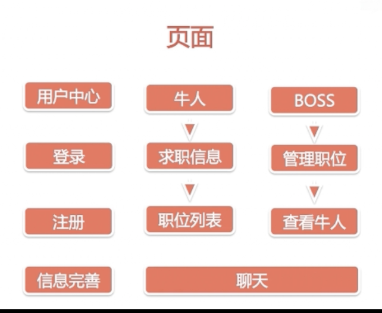
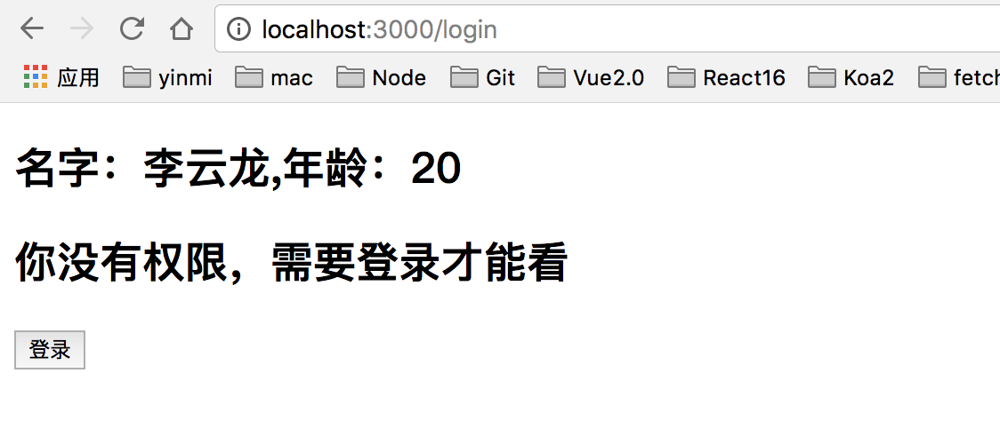
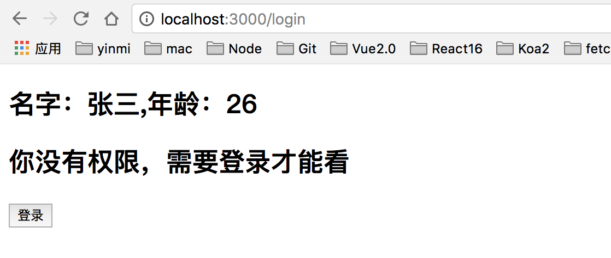

# 需求分析

## 页面架构和用户交互流程

### 页面
 
 
 
#### 文件架构和规范

* src前端源码目录
* server后端express目录
* 根据功能文件夹：component，container，reducers等 

#### router怎么划分页面

* 进入应用时获取用户信息，用户未登录跳转login页面
* login和register页面不需要权限认证
* 用户信息，聊天列表，职位列表页面共享底部tab-bar

#### 其他注意事项

* MongoDB字段设计
* axios发送异步请求
* redux管理所有数据，组件尽量用antd-mobile，弱化css

### 交互

#### 前后端联调

使用axios发送异步请求

* 如何发送，端口不一致，使用proxy配置转发

* axios拦截器，可以统一loading处理

* redux里使用异步数据，渲染页面

#### axios

安装：

    npm install axios --save
    
配置package.json

    "proxy":"http://localhost:9093",    
 
使用：

    import axios from 'axios'

* axios.request(config)
* axios.get(url[, config])
* axios.delete(url[, config])
* axios.head(url[, config])
* axios.options(url[, config])
* axios.post(url[, data[, config]])
* axios.put(url[, data[, config]])
* axios.patch(url[, data[, config]])    

案例：不使用redux

src.Auth.js

    // 认证的页面
    import React from 'react'
    import {connect} from 'react-redux'
    import {Redirect} from 'react-router-dom'
    import axios from 'axios'
    
    import {login} from "./Auth.redux";
    
    // 两个reducers，每个reducers都有一个state，所以需要合并reducers
    
    @connect(
        state=>state.auth,
        {login}
    )
    
    class Auth extends React.Component{
        constructor(props){
            super(props)
            this.state={
                data:{}
            }
        }
        componentDidMount(){
            axios.get('/data')
                .then(response=>{
                    if(response.status == 200){
                        this.setState({data:response.data})
                    }
                })
        }
        render(){
            console.log(this.state.data)
          return(
              

                  <h2>我的名字是：{this.state.data.user}</h2>
                  {this.props.isAuth ? <Redirect to='/dashboard'></Redirect> : null}
                  <h2>你没有权限，需要登录才能看</h2>
                  <button onClick={this.props.login}>登录</button>
              

          )
        }
    }
    export default Auth
    
使用redux

src/Auth.redux.js

    // 登录相关的redux页面
    import axios from 'axios'
    
    const LOGIN = 'LOGIN'
    const LOGOUT = 'LOGOUT'
    const USER_DATA = 'USER_DATA'
    // 初始值
    const initState = {
        isAuth:false,
        user:'李云龙',
        age:20
    }
    
    export function auth(state=initState,action) {
        console.log(state,action)
        switch (action.type){
            case LOGIN:
                return {...state,isAuth:true}
            case LOGOUT:
                return {...state,isAuth:false}
            default:
                return state;
        }
    }
    
    // action
    
    // 异步获取数据
    export function getUserData() {
        // dispatch用来同事数据修改
        return dispatch=>{
            axios.get('/data')
                .then(res=>{
                    if (res.status === 200){
                        dispatch(userData(res.data))
                    }
                })
        }
    }
    export function userData(data) {
        return {type:USER_DATA,payload:data}
    }
    
    export function login() {
        return {type:LOGIN}
    }
    export function logout() {
        return {type:LOGOUT}
    }
    
src/Auth.js

    // 认证的页面
    import React from 'react'
    import {connect} from 'react-redux'
    import {Redirect} from 'react-router-dom'
    
    import {login,getUserData} from "./Auth.redux";
    
    @connect(
        state=>state.auth,
        {login,getUserData}
    )
    
    class Auth extends React.Component{
        componentDidMount(){
            this.props.getUserData()
        }
        render(){
          return(
              

                  <h2>名字：{this.props.user},年龄：{this.props.age}</h2>
                  {this.props.isAuth ? <Redirect to='/dashboard'></Redirect> : null}
                  <h2>你没有权限，需要登录才能看</h2>
                  <button onClick={this.props.login}>登录</button>
              

          )
        }
    }
    export default Auth        
    
联调结果显示：显示默认的initState

修改src/Auth.redux.js的auth函数，添加case USER_DATA，显示数据库的内容

src/Auth.redux.js

    // 登录相关的redux页面
    import axios from 'axios'
    
    const LOGIN = 'LOGIN'
    const LOGOUT = 'LOGOUT'
    const USER_DATA = 'USER_DATA'
    // 初始值
    const initState = {
        isAuth:false,
        user:'李云龙',
        age:20
    }
    
    export function auth(state=initState,action) {
        console.log(state,action)
        switch (action.type){
            case LOGIN:
                return {...state,isAuth:true}
            case LOGOUT:
                return {...state,isAuth:false}
            case USER_DATA:
                return {...state,...action.payload}
            default:
                return state;
        }
    }
    
    // action
    
    // 异步获取数据
    export function getUserData() {
        // dispatch用来同事数据修改
        return dispatch=>{
            axios.get('/data')
                .then(res=>{
                    if (res.status === 200){
                        dispatch(userData(res.data))
                    }
                })
        }
    }
    export function userData(data) {
        return {type:USER_DATA,payload:data}
    }
    
    export function login() {
        return {type:LOGIN}
    }
    export function logout() {
        return {type:LOGOUT}
    }
    
显示结果：

    
    
#### axios拦截器

* axios.interceptors设置拦截器，比如全局的loading
* axios.get,axios.post发送请求，返回promise对象
* redux里获取数据，然后dispatch即可    